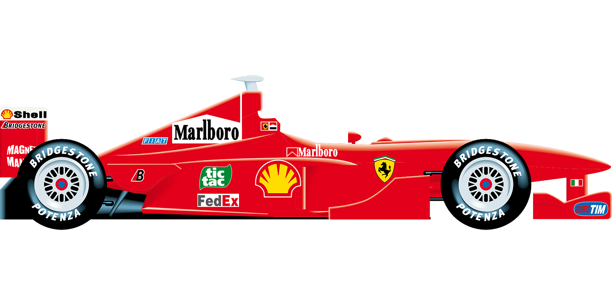
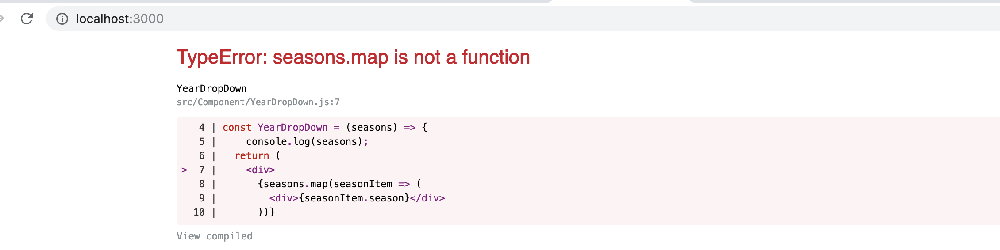

### Formula-1

  

# React Project Proposal Overview

### Project Description
**Welcome to "Formula 1"**
This web will render race details from 1950 till 2019 for all formula race along with the rounds and winners details.

### Project Links

[Github Repo](https://github.com/RB99175/Project2_React "Github Repo")

[Json Data](http://ergast.com/api/f1/current.json)

[Third Party API](http://ergast.com/mrd/methods/seasons/ "Third Party API")

[WireFrame](https://github.com/RB99175/Project2_React/blob/master/WireFrame.png  "WireFrame")

[WireFrame2](https://github.com/RB99175/Project2_React/blob/master/WireFrame2.png "WireFrame2")


### Key Milestone
##### MVP:
- User will see the homepage along with welcome home page 
- User can select the year between 1950-2019 from the drop down
- User can see the year wise formula 1 race details like:
   - Season
   - Round
   - Race
   - Locality
   - Country
   - Wikipedia page for each winner 
- User can navigate back to the home page

##### Post-MVP:
- Writing out components and its descriptions which will be helpful to the client.
- Based on the initial logic defined in the previous sections will breakdown the logic further into stateless/stateful components.

### Key Features:
- Interactive website
- Click event
- Render drop down
- Using thrid party API
- App compatiable using browser
- Using create react app
- Using flexbox and CSS
- Deploy in Netlify
- Test using Jest


### Additional Libraries
- ReactStrap
- React dependencies

### React Architecture
```
src
  +-- Container
   +-- HomePage.js
   +-- Results.js
  +-- Container
   |   +-- Button.js
   |   +-- QueryDetails.js
   |   +-- RaceTable.js
   |   +-- YearDropDown.js  
```
 
 ### Components
 | Components  | Description  |  
| :------------ |:---------------:| 
| Button.js      | Resuability function, passing click function | 
| QueryDetails.js | Summary of selected year        |   
| RaceTable.js | Details of Race for that year     |

 
 
### Code Snipnet
- I was successfully able to route and render multiple pages. This idea came to me when I looked at the API data first as what informtion I am getting and how I need to render it on my pages.

``` <BrowserRouter>
      <div className="App">
        <Route exact={true} path="/" component={HomePage} />
        <Route path="/Results/:id" component={Results} />
      </div>
    </BrowserRouter>
```


### Plan
#### Bronze:
- Create proposal for creating final product for react App
- Create Componets and import necessary dependiences as requried 
- Create home page using HTML and CSS
- Test using Jest or browser
- Create link to render detail page from home page
- Style the page using CSS /flex box
- Create back button 
- Create grids to render Year wise details

#### Silver:
- Use API key to render the data for 'year' in the dropdown
- Render year details, series, season, detail for winner on detail page
- Render data in grid using API 
- Link WIKI page for each winner 
- Test code using Jest or browser

#### Gold:
- Test the project from other users
- Fix bugs if seen
- Using Bootstrap/Reactstrap will fine tune the project 
- Record the presentation 
- Finalize the Readme
- Ready for presentation 


### Stretch Goal:
- Render Winner details on home page year wise 
- Write Readme with project details


### Time Frames
|  Component |  Priority |  Estimated Time |  Time Invested | Actual Time  |
| ------------ | ------------ | ------------ | ------------ | ------------ |
| Creating Proposal  |  H | 4Hrs | 5Hrs |  5Hrs |
|   |   |   |   |   |
|  Total | H | 4Hrs  | 5Hrs  |  5rs |


### Issues and Resolutions

## (1)

- Received above error while setting the data in the set.state as an arry
- Realised that adding curly braces inside the data resolved the issue as without curly braces it was reading from an object and with curly braces its reading from an arrary.


 

